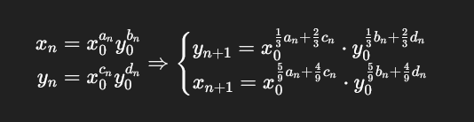

## NOP_CTF_2025

### 1.Meago

```py
#!/usr/bin/env sage

import sys
from Crypto.Util.number import *
from flag import flag

def die(*args):
	pr(*args)
	quit()
	
def pr(*args):
	s = " ".join(map(str, args))
	sys.stdout.write(s + "\n")
	sys.stdout.flush()

def sc(): 
	return sys.stdin.buffer.readline()

nbit = 100
prec = 4 * nbit
R = RealField(prec)

def meago(x, y):
	y = (x * y**2) ** R(1/3)
	x = (x * y**2) ** R(1/3)
	return x, y

def main():
	border = "┃"
	pr(        "┏━━━━━━━━━━━━━━━━━━━━━━━━━━━━━━━━━━━━━━━━━━━━━━━━━━━━━━━━━━━━━━━━━━━━┓")
	pr(border, ".::             Welcome to Meago oracle challenge!            ::. ", border)
	pr(border, " You should analyze this oracle and manage it to obtain the flag! ", border)
	pr(        "┗━━━━━━━━━━━━━━━━━━━━━━━━━━━━━━━━━━━━━━━━━━━━━━━━━━━━━━━━━━━━━━━━━━━━┛")
	m = bytes_to_long(flag)
	x0 = R(10 ** (-len(str(m))) * m)
	while True:
		y0 = abs(R.random_element())
		if y0 > x0: break
	assert len(str(x0)) == len(str(y0))
	c = 0
	pr(border, f'We know y0 = {y0}')
	while True:
		pr("| Options: \n|\t[M]eago \n|\t[Q]uit")
		ans = sc().decode().strip().lower()
		if ans == 'm':
			x, y = meago(x0, y0)
			x0, y0 = x, y
			c += 1
			if c <= 5:
				pr(border, f'Sorry, no info available here!')
			else: pr(border, f'y = {y}')
		elif ans == 'q': die(border, "Quitting...")
		else: die(border, "Bye...")

if __name__ == '__main__':
	main()
```

ta có flag được mã hóa thành `x0`, ngoài ra đã có `y0` và ta có hàm như sau:

$$
	y_{(n + 1)} = (x_n * y_n^2) ^ {(1/3)}
;
	x_{(n + 1)} = (x_n * y_{n + 1}^2) ^ {(1/3)}
$$

$\to x_{n + 1} = (x_n * ((x_n * y_n^2) ^ {1/3})^2) ^ {1/3} = x_n^{5/9} * y_n^{4/9}$

$\to y_{n + 1} = (x_n^{1/3} * y_n^{2/3})$



khi đó ta có thể tính $x_0 = (y_n / y_0^d) ^ {1/c}$. Ta có thể thấy đây là 1 hàm hội tụ nên nếu ta có $y_n$ với n càng lớn thì ta càng có thể tính chính xác $x_0$. Do $y_{(n + 1)} = (x_n * y_n^2) ^ {(1/3)}$ nên $x_n = (y_{n + 1} ^ 3)/(y_n ^ 2)$. do đã có cặp x_n, y_n nên ta có thể tính được $x_{n+ 1}, y_{n+ 1}$ và theo công thức tính x0 ở trên thì ta có thể dễ dàng có flag. Nhưng do flag lớn quá nên ta bị mất một vài phần và ta phải guessing phần còn lại.

```py
import os
os.environ["TERM"] = "linux"
import sys
from Crypto.Util.number import *
from pwn import *
from tqdm import *

nbit = 100
prec = 4 * nbit
R = RealField(prec)

def meago(x, y):
	y = (x * y**2) ** R(1/3)
	x = (x * y**2) ** R(1/3)
	return x, y

s = connect("0.cloud.chals.io", 22748)
# s = process(["sage", "meago.sage"])
# context.log_level = "debug"
s.send(b"m\n" * 5)
s.recvuntil(b"y0 = ")
y0 = R((s.recvline().strip().decode()))
k = 40000


s.sendline(b"m")
s.recvuntil(b"y = ")
y6 = R((s.recvline().strip().decode()))

s.sendline(b"m")
s.recvuntil(b"y = ")
y7 = R((s.recvline().strip().decode()))

x6 = R((y7 ** 3)/(y6 ** 2)) + R(10 ** (-120))

for i in trange(k - 1):
    x6, y6 = meago(x6, y6)

a, b, c, d = 1, 0, 0, 1

def cacl(a, b, c, d):
    a1 = 5/9 * a + 4/9 * c
    b1 = 5/9 * b + 4/9 * d
    c1 = 1/3 * a + 2/3 * c 
    d1 = 1/3 * b + 2/3 * d
    return a1, b1, c1, d1

for i in trange(4 + k):
    a, b, c, d = cacl(a, b, c, d)
    
x = (y6 * x6/(y0 ^ (d + b)))^(1 / (c + a))
print(x)
print(long_to_bytes(132319036933719016150144442420049870663057484788499311967590059162661889026143279739155894808721624960681249080614016202 * 10 ** 8))
# N0PS{fl04T_nUm8eR_RePre53nT_rEal_v4Lue_Wi7h_d3c1mal5}

```

### 2. n0pischu

```py
#!/usr/bin/env python3

import sys, time
from Crypto.Util.number import *
from secret import decrypt, FLAG

def die(*args):
	pr(*args)
	quit()
	
def pr(*args):
	s = " ".join(map(str, args))
	sys.stdout.write(s + "\n")
	sys.stdout.flush()

def sc(): 
	return sys.stdin.buffer.readline()

def jam(x, y, d, n):
	x1, y1 = x
	x2, y2 = y
	_jam = (x1 * x2 + d * y1 * y2, x1 * y2 + x2 * y1)
	return (_jam[0] % n, _jam[1] % n)

def keygen(nbit):
	p, q = [getPrime(nbit) for _ in '01']
	a = getRandomRange(1, p * q)
	pkey = p * q
	skey = (p, q)
	return pkey, skey

def polish(skey, l):
	nbit = skey[0].bit_length()
	PLS = [skey[getRandomRange(0, 2)] * getPrime(nbit) + getRandomNBitInteger(nbit >> 1) for _ in range(l)]
	return PLS

def encrypt(m, pubkey):
	n = pubkey
	e, r = 65537, getRandomRange(1, n)
	s = r * m % n
	u = (s + inverse(s, n)) * inverse(2, n) % n
	a = (inverse(s, n) - u) * inverse(m, n) % n
	d = pow(a, 2, n)
	c, f = (1, 0), 1
	for _ in range(e):
		c = jam(c, (u, m), d, n)
		f = f * a % n
	return c, f

def main():
	border = "┃"
	pr(        "┏━━━━━━━━━━━━━━━━━━━━━━━━━━━━━━━━━━━━━━━━━━━━━━━━━━━━━━━━━━━━━━━━━━━━┓")
	pr(border, ".::               Welcome to N0PSichu challenge!              ::. ", border)
	pr(border, " You should analyze this cryptosystem and braek it to get the flag", border)
	pr(        "┗━━━━━━━━━━━━━━━━━━━━━━━━━━━━━━━━━━━━━━━━━━━━━━━━━━━━━━━━━━━━━━━━━━━━┛")
	nbit = 512
	pkey, skey = keygen(nbit)
	m = bytes_to_long(FLAG)
	enc = encrypt(m, pkey)
	_m = decrypt(enc, skey)

	while long_to_bytes(_m) == FLAG:
		pr("| Options: \n|\t[E]ncrypt \n|\t[I]formations \n|\t[P]olish the keys \n|\t[Q]uit")
		ans = sc().decode().strip().lower()
		if ans == 'e':
			pr(border, 'please send your message to encrypt: ')
			_m = sc().decode().strip()
			try:
				_m = int(_m)
			except:
				die(border, 'Your input is not correct! Bye!')
			_m = _m % pkey
			_enc = encrypt(_m, pkey)
			pr(border, f'enc = {_enc}')
		elif ans == 'i':
			pr(border, f'pkey = {pkey}')
			pr(border, f'encrypted_flag = {enc}')
		elif ans == 'p':
			pr(border, 'Please let me know how many times you want to polish and burnish the key: ')
			l = sc().decode().strip()
			chance = int(str(time.time())[-2:])
			try:
				l = int(l) % chance
			except:
				die(border, 'Please be polite! Bye!!')
			PLS = polish(skey, l)
			i = 0
			for pls in PLS:
				pr(border, f'PLS[{i}] = {PLS[i]}')
				i += 1
		elif ans == 'q': die(border, "Quitting...")
		else: die(border, "Bye...")

if __name__ == '__main__':
	main()
```

ta có leak là `[skey[getRandomRange(0, 2)] * getPrime(nbit) + getRandomNBitInteger(nbit >> 1) for _ in range(l)]`

do đó có 2 trưởng hợp như sau:
+ p * k + r
+ q * k + r

nó trở thành bài toán AGCD. ta chỉ cần 3 output có chung ẩn p, hoặc q là có thể tìm lại p hoặc q tương ứng nên ta có thể thử với tỷ lệ (1/8).

```py
def jam(x, y, d, n):
	x1, y1 = x
	x2, y2 = y
	_jam = (x1 * x2 + d * y1 * y2, x1 * y2 + x2 * y1)
	return (_jam[0] % n, _jam[1] % n)
```

đây là hàm nhân của chương trình, ta thấy với x * y = (x1, y1) * (x2, y2) = (x1 + y1 * a) * (x2 + y2 * a) = (x1 * x2 + a^2 * y1 * y2) + (x1 * y2 + x2 * y1) * a = (x1 * x2 + d * y1 * y2, x1 * y2 + x2 * y1).

đây là trường đa thức mở rộng trong zmod(n) mà ta có thể factor n từ leak như bên trên nên ta có thể tìm phi rồi tính nghịch đảo giống RSA để tìm lại flag.

```py

import os
os.environ["TERM"] = "linux"
from pwn import *
from Crypto.Util.number import *
from tqdm import *

while 1:
    s = connect("0.cloud.chals.io", 19964) 
    # s.interactive()

    s.sendline(b"i")

    s.recvuntil(b"pkey = ")
    n = int(s.recvline().strip())
    s.recvuntil(b"encrypted_flag = ")
    enc = eval(s.recvline().strip())

    s.sendline(b"p")
    s.sendline(b"3")

    l = []

    for i in trange(3):
        s.recvuntil(f"PLS[{i}] = ".format(i).encode())
        l.append(int(s.recvline().strip()))

    def agcd(N: list[int], R):
        n = N[0]

        M = block_matrix([
            [matrix([[R]]), column_matrix(N[1:]).T],
            [0, diagonal_matrix([-n]* (len(N) - 1)) ]
        ])

        q = int(abs(M.LLL()[0][0] // R))
        p = n // q
        return p

    nbit = 512
    p = (agcd([n] + l, 1 << (nbit >> 1)))
    q = n // p

    if not(p * q == n and is_prime(p) and is_prime(q)):
        continue
    print(f"{p = }")
    print(f"{q = }")

    a = pow(enc[1], pow(65537, -1, (p - 1) * (q - 1)), n)

    K = Zmod(n)
    R.<t> = PolynomialRing(K)
    F.<i> = K.extension(t^2 - a^2, 'a')
    ll = ((enc[0][0] + enc[0][1] * i))
    flag = (ll^(pow(65537, -1, (p - 1) * (q - 1))))

    print(long_to_bytes(int(str(flag).split("*i")[0])))
    exit()

```
